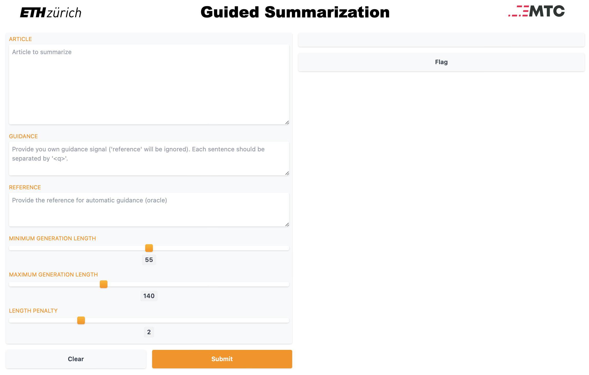

# MTC - Interactive Summarization

© 2022-2023 ETH Zurich. See [AUTHORS.txt](AUTHORS.txt) for more details.

Newsletters and leads (i.e. opening paragraphs in news articles) aim at 
summarizing the most important information in an article while maintaining 
the reader’s attention. Nowadays this task is done manually, since text quality
of state-of-the-art summarization models is not sufficient yet. Thus,
we propose a solution with an interactive setting, where the user is guiding
the automated generation of texts towards more appropriate summarizations for
these specific use cases.

## Setup


Make a virtual environment and install the packages in the requirements.txt:
```bash
pip install -r requirements.txt
```

The setup has been tested using pyton 3.7 and cuda 11.7, other versions should
work as well. However, you might have to change the torch version as well.

Additionaly you will have to download the `punkt` package from nltk:

```python
import nltk
nltk.download('punkt')
```

## Arguments

Arguments can be provided through one or several `.json` config files - where
latter ones overwrite values for identical keys of earlier ones. In addition
command line arguments can be provided, which have the priority on all given
arguments (config json arguments / default arguments).

The order of priority (first with highest priority) in which the provided
arguments are considered is:

    - cli arguments
    - last config file
    - ...
    - first config file
    - dataclass defaults

- Example of provding a single config file to as script:

```bash
python3 train_abstractive.py --config <path_to_config_file>
```

- Example of providing multiple config files to a script:

```bash
python3 train_abstractive.py --config <path_to_config_file1> <path_to_config_file2> ...
```

- Example of providing a config file with a cli argument (that possibly
overwrites the value if it is present in the config file):

```bash
python3 train_abstractive.py --config <path_to_config_file> --num_train_epochs 10
```

All arguments can be provided either through the command line (cli) or through a
`.json` config file. In addition, it is possible to provide comments within
these config files by adding entries whose name starts with an underline (e.g.
"_CHeeSEArguments"). This can help keeping the arguments organized.
For most arguments the documentation and possible choices can be found in
`summarization/utils/arguments`. However, for argument dataclasses that inherit
from Huggingface's argument dataclasses (such as TrainingArguments), the
remaining possibilities can be directly found in HuggingFace's documentation:
e.g. [TrainingArguments](https://huggingface.co/transformers/main_classes/trainer.html#transformers.TrainingArguments/).
## Workflow

#### 1. Train models

Using the **```train_abstractive.py```** script:

- end-to-end training (with train/validation and testing)
- possibility for hyperparameter search (using optuna or wandb sweeps)

Example for `cnn_dailymail` dataset:
```bash
cd summarization
python3 train_abstractive.py --config configs/train/cnn/_base.json [further_configs] \
                             --pretrained_model_name_or_path facebook/bart-large-cnn \
                             --output_dir <path_where_to_write_model_and_results> \
                             [further_cli_parameters]
```

#### 2. Hyperparameter search using wandb

The following steps are required to run a hyperparameter search, also called
**sweep** in wandb.

- First login to your wandb account via command line:

```bash
wandb login
```

- Then create a sweep using a .yaml config file (an example file can be found
on `summarization/configs/_wandb/cnn/wandb_sweep_2.yaml`):

```bash
wandb sweep wandb_sweep_2.yaml
```

- Then launch an agent that will do one run at a time. The command can be run 
  on as many machines that you want (also on Euler nodes) and wandb will take
  care of organising the joint search: 

```bash
cd summarization
wandb agent <WANDB_USER_NAME>/<PROJECT_NAME>/<SWEEP_ID>
```

- On euler the same can be done with the following command (make sure to do all
  the euler setup first, *see later section*, and to add the required information within 
  `summarization/scripts/euler_config.json`):
```bash
cd summarization/scripts
bash run_euler.sh "wandb agent <WANDB_USER_NAME>/<PROJECT_NAME>/<SWEEP_ID>"
```
- If you want to limit the number of runs (trained models) that a agent will do:

```bash
cd summarization
wandb agent --count <N_RUNS> <WANDB_USER_NAME>/<PROJECT_NAME>/<SWEEP_ID>
```

The latter can be useful in case you run agents on euler where the time the
nodes run is limited and you want to avoid that training runs get cancelled
before they complete.

#### 3. Evaluate models

Using the **```train_abstractive.py```** script.

Example for `cnn_dailymail` dataset:
```bash
cd summarization
python3 train_abstractive.py --config configs/evaluate/cnn/_base.json [further_configs] \
                             --pretrained_model_name_or_path <path_to_trained_model> \
                             --output_dir <path_where_to_write_results>
```

#### 4. Model prediction endpoint

The following lines enable predictions with GuidedBart models:

```python
# Import
from pipeline import GuidedSummarizationPipeline

# Variables
min_length = 55
max_length = 140
length_penalty = 2
clean_up_tokenization_spaces = True
model_checkpoint_path = "/path/to/my/checkpoint_folder"

# Data
inputs = [
    {"article": "My first article", "guidance": "Guidance for first article"}, 
    {"article": "My second_article", "guidance": "Guidance for second article"}
]

# Pipeline for prediction
pipe = GuidedSummarizationPipeline(model_checkpoint_path)

# Predictions using a single sample
prediction = pipe(
    inputs[0],
    min_length=min_length,
    max_length=max_length,
    length_penalty=length_penalty,
    clean_up_tokenization_spaces = clean_up_tokenization_spaces
)

# Predictions using multiple samples
prediction = pipe(
    inputs,
    min_length=min_length,
    max_length=max_length,
    length_penalty=length_penalty,
    clean_up_tokenization_spaces = clean_up_tokenization_spaces
)
```

#### 5. Local UI demo

The `demo/app.py` script can be used to run a **Gradio UI** that allows to 
visualize the output of a model using custom inputs (article+guidance) from the 
user.

```bash
cd demo
python3 app.py <path_to_model_checkpoint>
```

The UI should look as following:



## License

All code in this repository is licensed under the Apache License, Version 2.0 (see [LICENSE.txt](LICENSE.txt)).